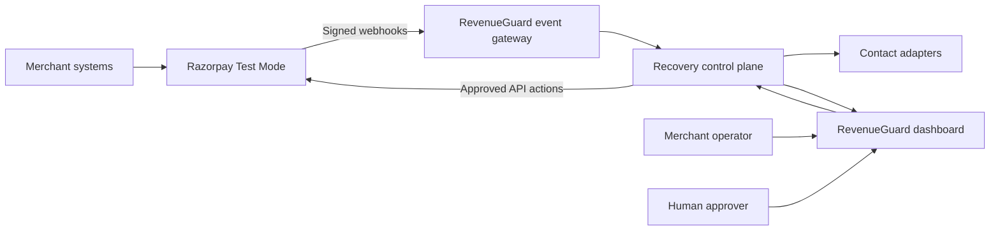
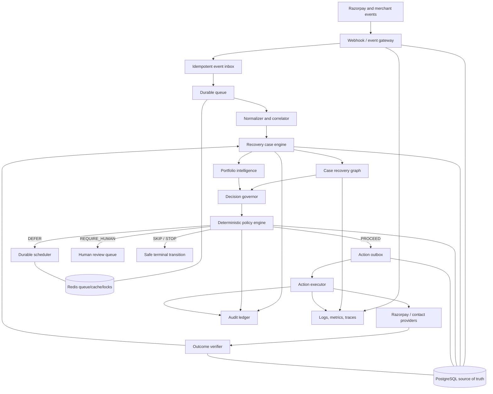
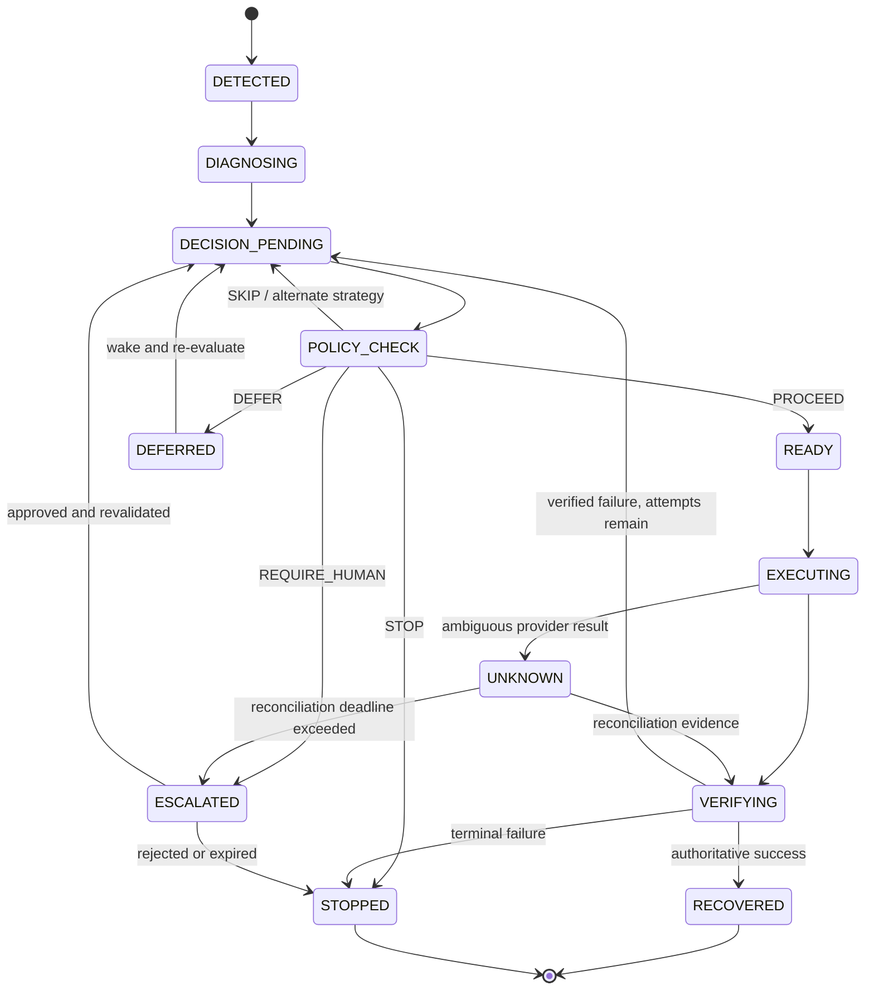
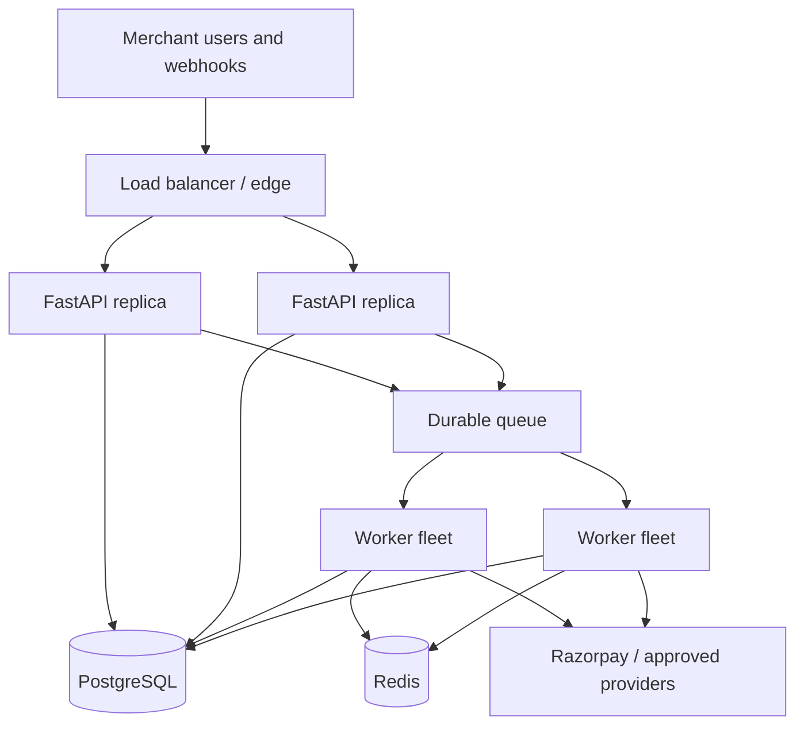

# RevenueGuard Architecture

RevenueGuard is a unified, event-driven revenue recovery control plane for Razorpay merchants. It detects revenue at risk, creates durable recovery cases, recommends an intervention, applies deterministic policy, executes approved actions idempotently, verifies the result, and reports only confirmed money recovered.

This document is the implementation-facing architecture. The broader design rationale is preserved in [the source architecture document](sources/RevenueGuard%20%E2%80%94%20Unified%20Agentic%20Revenue%20Recovery%20Control%20Plane.md), while delivery phases and exit gates are defined in [IMPLEMENTATION_PLAN.md](IMPLEMENTATION_PLAN.md).

## 1. Goals

- Recover revenue from failed subscriptions, payment degradation, overdue receivables, and related leakage.
- Coordinate decisions at both individual-case and merchant-portfolio levels.
- Keep AI recommendations bounded by deterministic policy and explicit permissions.
- Guarantee idempotent processing and exactly-once business effects as far as external provider APIs allow.
- Represent ambiguous external outcomes honestly as `UNKNOWN` and reconcile them before acting again.
- Provide human approval, stopping rules, explainable decisions, and a tamper-evident audit trail.
- Measure verified gross and net money recovered across reproducible batches.

## 2. Non-goals

- Giving an LLM direct authority to debit, refund, change an amount, or contact a customer.
- Treating LangGraph, Redis, or model memory as the financial source of truth.
- Claiming exactly-once message delivery; the system targets exactly-once business effects over at-least-once delivery.
- Treating a provider API acknowledgement as proof that money was recovered.
- Presenting synthetic evaluation results as real merchant production outcomes.
- Building every possible recovery playbook before the three core workflows are reliable.

## 3. Core principles

1. **PostgreSQL is truth.** Durable financial state, policy versions, actions, outcomes, and audit records live in PostgreSQL.
2. **AI recommends; policy authorizes.** Model output is advisory and schema-constrained.
3. **Execution is deterministic.** Approved actions are executed by ordinary services through an outbox.
4. **Success must be verified.** Provider state or a trusted signed event confirms recovery.
5. **Uncertainty halts equivalent actions.** An ambiguous result becomes `UNKNOWN`, not guessed success or failure.
6. **Every boundary is idempotent.** Webhook ingestion, case creation, decisions, outbox actions, and reconciliation have stable uniqueness keys.
7. **Policies are versioned.** Every decision records the exact rules, model, prompt, schema, and feature versions used.
8. **Autonomy is bounded.** Retry ceilings, contact limits, quiet hours, consent, disputes, ROI, incident state, and human approval are enforced in code.
9. **Portfolio context can override case recommendations.** A systemic incident must prevent a locally reasonable but globally harmful retry.
10. **Metrics are evidence-backed.** Only verified outcomes contribute to recovered-revenue totals.

## 4. System context



For the hackathon deployment, RevenueGuard runs beside Razorpay and connects only to Razorpay Test Mode. It does not run inside Razorpay infrastructure and does not use live merchant credentials.

## 5. Logical architecture



## 6. Component responsibilities

### 6.1 Webhook and event gateway

- Reads the unmodified request body.
- Resolves the target merchant safely.
- Verifies the Razorpay signature before business processing.
- Enforces payload-size, rate, timestamp, and replay controls.
- Inserts the event into the inbox using the provider event ID as a unique key.
- Returns `2xx` after durable storage; expensive work happens asynchronously.

### 6.2 Idempotent event inbox

- Preserves the raw payload, headers required for verification, source, receive time, and processing status.
- Uses a database uniqueness constraint to collapse duplicate deliveries.
- Dispatches stored events to the queue transactionally or through a recoverable dispatcher.
- Retains failed processing metadata for replay and investigation.

### 6.3 Normalizer and correlator

- Converts provider-specific payloads into a versioned `RevenueRiskEvent`.
- Correlates merchant, customer, payment, order, subscription, invoice, and payment-link identities.
- Preserves source event IDs and causation/correlation IDs.
- Rejects unsupported schema versions safely instead of guessing.

### 6.4 Recovery case engine

- Creates or updates the universal recovery case.
- Enforces valid state transitions.
- Persists every transition and the evidence that caused it.
- Wakes, defers, stops, escalates, or closes long-running workflows.
- Re-evaluates current policy whenever a deferred case resumes.

### 6.5 Case recovery graph

LangGraph coordinates bounded reasoning steps:

```text
load committed case context
→ diagnose
→ retrieve relevant evidence
→ score recovery strategies
→ generate allowed candidates
→ rank and explain
→ emit a typed recommendation
```

The graph has read-only tools. It cannot create a payment link, retry a payment, send a message, or mutate financial state directly.

The structured-model boundary uses an operator-configured OpenAI-compatible
`/v1/chat/completions` endpoint. Official OpenAI and compatible cloud services can use strict
JSON Schema responses; local servers such as Ollama, LM Studio, and vLLM can select JSON Object
mode and their supported token-limit field. Provider failure, timeout, invalid JSON, or schema
rejection always returns the graph's deterministic fallback. The configured base URL and model
name are trusted deployment configuration, never case input, and API credentials remain
server-side secrets.

### 6.6 Portfolio intelligence

- Aggregates recent success and failure behavior by merchant, payment method, issuer family, error family, and time window.
- Detects merchant-wide degradation and estimates blast radius.
- Creates versioned portfolio incidents and temporary policy constraints.
- Coordinates multiple cases belonging to the same customer.
- Prevents retry storms and duplicate customer contact.

### 6.7 Decision governor

The governor merges case recommendations, portfolio constraints, customer state, and economics. It ranks only actions that can subsequently pass policy.

The primary utility is:

```text
expected_net_recovery =
    P(recovery) × amount
    − intervention_cost
    − risk_penalty
    − customer_friction_penalty
```

The score prioritizes candidates; it never overrides a policy prohibition.

### 6.8 Deterministic policy engine

Each proposed action produces exactly one result:

- `PROCEED`: write an approved action to the outbox.
- `DEFER`: persist the reason and schedule re-evaluation.
- `SKIP`: omit this action but allow other eligible strategies.
- `STOP`: terminate automated recovery for the case.
- `REQUIRE_HUMAN`: pause and create an approval request.

Initial guardians cover:

- Maximum payment retries and automated contacts.
- Contact consent, opt-out, channel permission, and quiet hours.
- Already-paid, disputed, cancelled, or terminal customer state.
- Minimum expected recovery value and intervention cost.
- High-value or low-confidence human approval.
- Active systemic degradation incidents.
- Unknown equivalent actions awaiting reconciliation.
- Merchant-specific allowed and forbidden capabilities.

Policy evaluation is a pure operation over immutable input plus a versioned policy snapshot.

### 6.9 Action outbox and executor

- The case transition and action outbox record are committed in one database transaction.
- Every action receives a stable idempotency key derived from merchant, case, action type, target, and logical attempt.
- Workers claim outbox records safely and record each attempt.
- Provider adapters translate internal commands to Razorpay Test Mode or approved communication calls.
- Retries are bounded and use backoff; ambiguous calls are never blindly repeated.

### 6.10 Outcome verifier

- Correlates API responses, provider lookups, and later signed webhooks.
- Distinguishes `SUCCEEDED`, `FAILED`, and `UNKNOWN`.
- Blocks equivalent execution while the prior action remains unknown.
- Updates recovered-money metrics only after authoritative confirmation.
- Periodically reconciles aged unknown actions and escalates unresolved cases.

### 6.11 Human review

- Stores the proposed action, evidence, policy reason, risk, and expiry.
- Allows an authorized merchant operator to approve or reject.
- Re-runs policy at resume time because consent, payment, incident, or merchant policy may have changed.
- Records the human identity and rationale in the decision receipt.

## 7. Domain model

### 7.1 Canonical revenue-risk event

```text
RevenueRiskEvent
├── event_id
├── schema_version
├── merchant_id
├── source and source_event_id
├── event_type and occurred_at
├── customer/payment/order/subscription/invoice references
├── amount_minor and currency
├── failure_code and normalized_failure_category
├── correlation_id and causation_id
└── source_payload_reference
```

### 7.2 Recovery case

```text
RecoveryCase
├── case_id and merchant_id
├── workflow_type
├── subject references
├── revenue_at_risk_minor and currency
├── state and state_version
├── diagnosis and confidence
├── retry/contact counters
├── active incident reference
├── next_evaluation_at
├── terminal reason
└── created_at and updated_at
```

### 7.3 Decision receipt

```text
DecisionReceipt
├── receipt_id, case_id, and correlation_id
├── evidence snapshot
├── candidate actions and scores
├── selected recommendation and explanation
├── policy result and reason codes
├── policy/model/prompt/schema/feature versions
├── human approval reference
├── resulting action or transition
└── timestamp and audit hash reference
```

### 7.4 Money representation

All amounts are integer minor units and an ISO currency code. Floating-point arithmetic is prohibited for financial values. Reports convert minor units only at presentation boundaries.

## 8. Recovery case state machine



Transitions use optimistic concurrency through `state_version`. A stale worker must fail rather than overwrite a newer case decision.

## 9. Core workflows

### 9.1 Failed subscription

```text
subscription failure
→ normalize and create case
→ classify failure
→ inspect history and portfolio health
→ score retry later / method update / payment link / contact / stop
→ apply policy
→ execute or defer
→ verify charged or paid event
→ recover, adapt, escalate, or stop
```

### 9.2 Payment degradation

```text
stream of outcomes
→ aggregate by method, issuer, failure family, and time
→ compare with merchant baseline
→ detect correlated spike
→ create incident and affected-case set
→ pause retry and suppress unnecessary contact
→ monitor recovery criteria
→ resolve incident
→ re-evaluate and gradually resume deferred cases
```

### 9.3 B2B promise-to-pay

```text
overdue invoice
→ staged policy-approved outreach
→ structured extraction of reply intent/date/amount
→ persist promise and schedule reminder
→ verify payment or broken promise
→ freeze immediately on dispute
→ escalate to a human when required
```

## 10. Persistence

Core PostgreSQL tables:

```text
merchants
merchant_policies
webhook_events
customers
payments
subscriptions
invoices
recovery_cases
case_transitions
portfolio_incidents
model_predictions
decision_receipts
recovery_actions
action_attempts
communication_consent
promise_to_pay
human_reviews
audit_entries
```

Important constraints include:

- Unique `(provider, merchant_id, provider_event_id)` for webhook deduplication.
- Unique case keys for each logical merchant workflow subject.
- Unique action idempotency key.
- Check constraints for non-negative minor-unit amounts and counters.
- Foreign keys scoped through merchant ownership.
- Immutable policy/version references on historical decisions.

Redis is restricted to queues, caching, rate limiting, and distributed coordination. Redis loss must not erase authoritative case or financial history.

## 11. Delivery, ordering, and concurrency

- Assume webhooks and queue messages are delivered at least once.
- Do not assume events arrive in chronological order.
- Compare provider timestamps and current authoritative object state before applying a transition.
- Lock or use optimistic concurrency on each case during a state-changing command.
- Partition work by merchant and subject where useful, while retaining database constraints as the final defense.
- Use dead-letter queues for poison events and preserve replay metadata.
- Apply backpressure and per-merchant rate limits during bursts.
- Resume incident-deferred cases gradually to prevent a thundering herd.

## 12. AI and ML boundary

### LLM responsibilities

- Interpret ambiguous customer replies.
- Produce structured diagnosis assistance from permitted evidence.
- Generate candidate strategies and explanations.
- Draft policy-approved communication.
- Summarize a case for a merchant operator.

### ML responsibilities

- Estimate calibrated recovery probability by action and time window.
- Prioritize recovery opportunities.
- Detect or support detection of correlated degradation.
- Estimate customer friction and intervention value where defensible.

### Deterministic responsibilities

- Amount and currency handling.
- Signature verification and authorization.
- Case state transitions and counters.
- Policy and stopping rules.
- Idempotency and outbox writes.
- Provider action execution.
- Outcome verification and recovered-money accounting.

All model calls require typed input/output, time and token limits, version capture, data minimization, and a deterministic fallback.

## 13. Auditability

Every material event, recommendation, policy decision, human decision, execution attempt, verification result, and state transition produces an audit entry.

Audit records form a SHA-256 hash chain:

```text
entry_hash = SHA256(
    canonical_entry_payload
    + previous_entry_hash
)
```

The chain provides tamper evidence, not absolute immutability. A verification command reports the first broken entry. Policy snapshots and version identifiers make historical decisions explainable without applying today's rules retroactively.

## 14. Security and privacy

- Verify webhook signatures over the raw body using constant-time comparison.
- Authenticate dashboard users and enforce merchant-scoped authorization on every query and command.
- Keep Razorpay and LLM credentials in a deployment secret manager.
- Encrypt traffic and sensitive stored data.
- Minimize personal data sent to models and redact traces.
- Enforce consent, allowed channels, contact limits, and quiet hours in deterministic policy.
- Apply payload limits, rate limits, timeouts, and replay controls at ingress.
- Preserve tenant isolation in schemas, indexes, queries, tests, and observability attributes.
- Define retention and deletion rules for webhook payloads, communications, and model traces.
- Never place secrets, raw credentials, or unnecessary customer data in audit hashes or logs.

## 15. Observability

### Infrastructure

- API latency and error rate.
- Queue depth, event age, retries, and dead letters.
- Worker utilization and throughput.
- Database latency, contention, and connection saturation.

### Agent

- Model latency, token usage, and cost.
- Structured-output failure and deterministic fallback rate.
- Tool calls and graph-node traces.
- Model, prompt, schema, and feature versions.

### Financial workflow

- Revenue at risk and verified gross/net recovery.
- Decision and action latency.
- Policy blocks, human escalations, and customer contacts.
- Duplicate action attempts and prevented duplicates.
- Unknown outcomes, their age, and reconciliation rate.
- Incident detection and resolution time.

OpenTelemetry supplies correlation across API, worker, graph, database, and provider boundaries. LangSmith may capture redacted LangGraph traces, but financial metrics remain in RevenueGuard-owned telemetry and PostgreSQL.

## 16. Deployment architecture

### Prototype

```text
Next.js dashboard          → Vercel or equivalent
FastAPI API                → container platform
Celery worker/scheduler    → container worker service
PostgreSQL                 → managed database
Redis                      → managed queue/cache
Razorpay                   → Test Mode only
```

### Production mapping



CI builds immutable API, worker, and web artifacts. A one-shot release job applies migrations before traffic reaches the new version. Readiness checks prevent unhealthy replicas from receiving traffic. Application rollback must never roll back financial history.

## 17. Testing architecture

The testing pyramid contains:

- Unit tests for state transitions, guardians, scoring, and money calculations.
- Property tests for bounded attempts, idempotency, and state-machine invariants.
- Contract tests using sanitized Razorpay Test Mode fixtures.
- Integration tests for PostgreSQL, queue delivery, outbox, migrations, and provider adapters.
- End-to-end tests from signed webhook through verified outcome.
- Resilience tests for duplicates, reordering, crashes, timeouts, unknown outcomes, queue pressure, and provider failure.
- Security tests for signature bypass, replay, authorization, secret leakage, and tenant isolation.
- Load tests for webhook bursts, queue recovery, database contention, and incident resumption.

Release invariants are:

```text
policy violations in controlled scenarios      = 0
duplicate external business effects            = 0
unverified money counted as recovered          = 0
actions beyond configured retry/contact limits = 0
```

## 18. Evaluation architecture

Evaluation uses three data tiers:

1. Sanitized Razorpay Test Mode fixtures for protocol correctness.
2. A replay harness for duplicates, delay, ordering, invalid signatures, and bursts.
3. Seeded synthetic merchant portfolios with hidden outcome probabilities.

The frozen held-out test set is evaluated against:

- No recovery action.
- Immediate static retry.
- Fixed-delay retry.
- Rules-only recovery.
- Case-only intelligence without portfolio coordination.

Reported model metrics include precision, recall, F1, PR-AUC, ROC-AUC, Brier score, calibration, subgroup performance, and out-of-distribution degradation.

Reported business and safety metrics include verified gross/net recovered revenue, incremental recovery over baseline, cost per recovered rupee, unnecessary interventions, contacts, escalations, policy blocks, duplicate effects, unknown outcomes, reconciliation time, and incident-detection quality.

Synthetic results must include generator version, seed, raw counts, uncertainty intervals, and a clear simulation disclosure.

## 19. Technology choices

| Layer | Choice |
|---|---|
| Web | Next.js and TypeScript |
| API | FastAPI and Python |
| Validation | Pydantic |
| Domain persistence | SQLAlchemy and PostgreSQL |
| Migrations | Alembic |
| Agent orchestration | LangGraph |
| LLM utilities | LangChain where useful |
| Initial ML | Calibrated logistic regression; LightGBM/XGBoost if justified |
| Prototype queue | Celery and Redis |
| Production queue mapping | SQS-style durable queue |
| Payments | Razorpay Test Mode |
| Observability | OpenTelemetry and optional LangSmith |
| Packaging | Docker |
| CI/CD | GitHub Actions |
| Audit | PostgreSQL append-only records and SHA-256 hash chain |

## 20. Architecture invariants

The implementation is conformant only while all of these remain true:

1. PostgreSQL is the authoritative financial and workflow store.
2. No model can directly invoke a money or customer-contact action.
3. Every action passes the current deterministic merchant policy.
4. Every external action has a stable idempotency key and durable outbox record.
5. Ambiguous execution enters `UNKNOWN` and blocks equivalent actions.
6. Recovered revenue is counted only after authoritative verification.
7. Duplicate and out-of-order events cannot regress terminal truth.
8. Deferred and human-approved workflows re-evaluate policy before execution.
9. Portfolio incidents can constrain case-level behavior.
10. Every material decision is explainable through a versioned receipt and audit entry.

Changes that violate an invariant require an explicit architecture decision record and a review of the security, test, and evaluation impact.
