# RevenueGuard

RevenueGuard is a bounded, event-driven revenue recovery control plane for Razorpay merchants. It is designed to detect revenue at risk, coordinate safe recovery decisions, apply deterministic merchant policy, execute approved actions idempotently, and count recovered money only after authoritative verification.

> **Current status — Phase 5 complete:** bounded LangGraph case intelligence produces typed, versioned recommendations through read-only tools; malformed, unavailable, or slow model calls fall back deterministically; and merchant policy remains the sole authority before any durable action is created.

## Safety model

RevenueGuard deliberately separates recommendation, authorization, execution, and verification:

```text
event → durable state → bounded recommendation → deterministic policy
      → idempotent action → provider verification → verified outcome
```

- PostgreSQL is the authoritative financial and workflow store.
- Redis is used only for queues, caching, rate limits, and coordination.
- An LLM or LangGraph node may recommend an action but cannot execute money movement or customer contact.
- Every external action passes deterministic policy at authorization and again immediately before execution, then uses a durable outbox with a stable idempotency key.
- Ambiguous provider results become `UNKNOWN`; they are never guessed as successful or failed.
- Revenue is counted as recovered only after authoritative provider confirmation.
- Development and demonstrations must use Razorpay Test Mode.

The complete invariants and contributor rules are defined in [AGENTS.md](AGENTS.md).

## Architecture

The target control flow is:

```mermaid
flowchart LR
    Event["Razorpay or merchant event"] --> Gateway["Webhook gateway"]
    Gateway --> Inbox["Idempotent event inbox"]
    Inbox --> Queue["Durable queue"]
    Queue --> Case["Recovery case engine"]
    Case --> Reasoning["Bounded reasoning"]
    Reasoning --> Policy["Deterministic policy"]
    Policy --> Outbox["Action outbox"]
    Outbox --> Executor["Action executor"]
    Executor --> Provider["Provider"]
    Provider --> Verify["Outcome verification"]
    Verify --> Case
```



Phase 5 inserts bounded diagnosis assistance, strategy generation, ranking, and explanation before the deterministic policy boundary. Model predictions are append-only PostgreSQL evidence linked to decision receipts; the Phase 4 outbox, execution, uncertainty, and verification guarantees remain unchanged.

## Current capabilities

| Area     | Implemented                                                                                                                                         |
| -------- | --------------------------------------------------------------------------------------------------------------------------------------------------- |
| API      | Raw-body Razorpay HMAC verification, tenant resolution, durable acceptance/deduplication, and system endpoints                                      |
| Worker   | Durable event and action dispatch, bounded explicit-failure retry, crash-to-`UNKNOWN`, reconciliation, and dead-letter retention                    |
| Web      | Responsive Next.js operational dashboard based on the Coinbase design reference                                                                     |
| Database | Merchant-scoped inbox, cases, model predictions, decisions, action outbox, attempts, and append-only verified outcomes via Alembic                  |
| Domain   | Typed cases, deterministic policy, stable action identity, explicit uncertainty, and verified outcome contracts                                     |
| Agents   | Typed six-step LangGraph, OpenAI-compatible cloud/local models, read-only tools, schema validation, redaction, budgets, and deterministic fallbacks |
| Quality  | Ruff, mypy, pytest, ESLint, TypeScript, Vitest, Prettier, and production build gates                                                                |
| Delivery | Six-mode webhook replay CLI plus the existing containers, locked dependencies, Make targets, and CI                                                 |
| Safety   | Calls are recorded before execution; incomplete calls are never blindly replayed; unverified outcomes count zero revenue                            |

## Technology stack

- **Frontend:** Next.js 16, React 19, TypeScript
- **API:** FastAPI, Pydantic
- **Persistence:** SQLAlchemy, PostgreSQL, Alembic
- **Async work:** Celery, Redis
- **Agent foundation:** LangGraph with bounded, read-only agent authority
- **Observability foundation:** OpenTelemetry
- **Tooling:** uv, npm workspaces, Docker Compose, GitHub Actions

Use the versions pinned in `.python-version`, `.nvmrc`, `uv.lock`, and `package-lock.json`.

## Repository layout

```text
apps/
  api/                    FastAPI service
  worker/                 Celery worker
  web/                    Next.js dashboard
packages/
  domain/                 Framework-independent domain contracts
  agents/                 Bounded agent orchestration boundary
  integrations/           External adapter boundary
  observability/          Logging, metrics, and tracing foundation
  evaluation/             Evaluation tooling boundary
migrations/               Alembic migrations
docs/
  adr/                     Architecture decisions
  contracts/               Versioned contract documentation
  evaluation/              Success criteria and evaluation gates
  product/                 Product scope
deploy/docker/             Production-oriented image definitions
sources/                   Original architecture and design source
tests/                     Cross-package and contract tests
```

## Prerequisites

- Python version specified by `.python-version`
- [uv](https://docs.astral.sh/uv/)
- Node.js version specified by `.nvmrc`
- npm 11
- Docker with Docker Compose
- GNU Make or a compatible `make`

## Quick start

From the repository root:

```bash
make env
make setup
make infra-up
make migrate
make bootstrap-merchant MERCHANT_ID=merchant_demo_001
```

`make env` creates `.env` from `.env.example` only when `.env` does not already exist. Keep real credentials in the ignored `.env` file or a secret manager—never in `.env.example`.

Start each application in a separate terminal:

```bash
make api
```

```bash
make worker
```

```bash
make web
```

### Local endpoints

| Endpoint                           | Purpose                         |
| ---------------------------------- | ------------------------------- |
| `http://localhost:3000`            | RevenueGuard dashboard          |
| `http://localhost:3000/api/health` | Dashboard server health         |
| `http://localhost:8000/docs`       | OpenAPI documentation           |
| `http://localhost:8000/health`     | API process liveness            |
| `http://localhost:8000/ready`      | PostgreSQL and Redis readiness  |
| `http://localhost:8000/version`    | Service version and environment |

The readiness endpoint returns HTTP `503` when PostgreSQL or Redis is unavailable.

### Live operator dashboard

The Phase 5 control room reads tenant-scoped state from PostgreSQL through the FastAPI dashboard
API. It never reads financial state from browser storage. Configure independent server-side
credentials in `.env`, then export that file in the web terminal so Next.js receives the same
server-only values:

```bash
REVENUEGUARD_DASHBOARD_API_TOKEN=<high-entropy-internal-api-token>
REVENUEGUARD_DASHBOARD_MERCHANT_ID=merchant_demo_001
REVENUEGUARD_DASHBOARD_OPERATOR_ACCESS_KEY=<operator-access-key>
REVENUEGUARD_DASHBOARD_SESSION_SECRET=<at-least-32-character-session-secret>
```

Then start the flow in separate terminals:

```bash
make infra-up
make migrate
make bootstrap-merchant MERCHANT_ID=merchant_demo_001
make api
```

```bash
make worker
```

```bash
set -a
source .env
set +a
make web
```

Open `http://localhost:3000/sign-in`, enter the configured operator access key, and replay a
sanitized Test Mode fixture using the command in the Phase 5 section below. The dashboard refreshes
every five seconds and exposes masked case references, state transitions, deterministic policy
receipts, bounded model traces, human reviews, idempotent actions, and authoritative outcomes.

## Verification

Run the complete repository gate:

```bash
make check
```

This performs formatting checks, linting, Python and TypeScript type checking, backend and frontend tests, a Next.js production build, and Docker Compose configuration validation.

Focused commands are also available:

```bash
make format-check
make lint
make typecheck
make test
make build
make phase0-test
```

### Runtime smoke tests

With the API, worker, web app, PostgreSQL, and Redis running:

```bash
curl --fail http://localhost:8000/health
curl --fail http://localhost:8000/ready
curl --fail http://localhost:8000/version
curl --fail http://localhost:3000/api/health
```

Send a diagnostic task through the real Redis-backed worker:

```bash
uv run python -c "from revenueguard_worker.tasks import ping; print(ping.delay().get(timeout=10))"
```

Expected result:

```text
{'status': 'ok', 'service': 'revenueguard-worker'}
```

Replay sanitized webhook fixtures after configuring a Test Mode merchant and exporting its webhook secret in the current shell:

```bash
export RAZORPAY_WEBHOOK_SECRET='your-test-mode-webhook-secret'
make replay-webhooks MODE=duplicate \
  MERCHANT_ID=merchant_demo_001 \
  FIXTURES='fixtures/razorpay/payment_failed.json'
```

Available modes are `normal`, `duplicate`, `invalid-signature`, `delayed`, `burst`, and `out-of-order`. The CLI derives stable provider event IDs from fixture bytes, signs those exact bytes, and returns a nonzero status when delivery expectations fail.

Dead-letter rows remain visible in PostgreSQL. An operator can requeue one explicitly while preserving replay count, time, and actor:

```bash
make requeue-dead-letter DISPATCH_ID='<uuid>' ACTOR='operator@example'
```

Confirm readiness fails honestly when a required dependency is unavailable:

```bash
docker compose stop redis
curl --include http://localhost:8000/ready
docker compose start redis
```

## Container builds

Build each deployable image from the repository root:

```bash
docker build --file deploy/docker/api.Dockerfile --tag revenueguard-api:local .
docker build --file deploy/docker/worker.Dockerfile --tag revenueguard-worker:local .
docker build --file deploy/docker/web.Dockerfile --tag revenueguard-web:local .
```

Docker Compose currently owns the local PostgreSQL and Redis dependencies. Application services run directly through the Make targets during development.

## Configuration

The checked-in `.env.example` contains local, non-secret defaults. Important variables include:

- `REVENUEGUARD_DATABASE_URL`
- `REVENUEGUARD_ALEMBIC_DATABASE_URL`
- `REVENUEGUARD_REDIS_URL`
- `REVENUEGUARD_CELERY_BROKER_URL`
- `REVENUEGUARD_CELERY_RESULT_BACKEND`
- `REVENUEGUARD_AGENT_MODEL_PROVIDER` (`DISABLED` or `OPENAI_COMPATIBLE`)
- `REVENUEGUARD_AGENT_MODEL_BASE_URL`
- `REVENUEGUARD_AGENT_MODEL_NAME`
- `REVENUEGUARD_AGENT_MODEL_RESPONSE_MODE` (`JSON_SCHEMA` or `JSON_OBJECT`)
- `REVENUEGUARD_AGENT_MODEL_TOKEN_LIMIT_FIELD` (`MAX_COMPLETION_TOKENS` or `MAX_TOKENS`)
- `REVENUEGUARD_AGENT_MODEL_TIMEOUT_SECONDS`
- `REVENUEGUARD_AGENT_WORKFLOW_TIMEOUT_SECONDS`
- `REVENUEGUARD_AGENT_MODEL_MAX_RETRIES`
- `REVENUEGUARD_AGENT_MODEL_MAX_OUTPUT_TOKENS`
- `REVENUEGUARD_AGENT_GRAPH_MAX_STEPS`
- `REVENUEGUARD_RAZORPAY_MERCHANT_ID`
- `REVENUEGUARD_ACTION_PROVIDER` (`SIMULATOR` by default or `RAZORPAY_TEST`)
- `REVENUEGUARD_ACTION_UNKNOWN_TTL_SECONDS`
- `REVENUEGUARD_API_URL`

Razorpay's direct webhook requests do not include RevenueGuard's internal merchant-routing
header. When `REVENUEGUARD_RAZORPAY_MERCHANT_ID` explicitly configures the sole Test Mode
merchant, a request with no routing header uses that merchant and still must pass raw-body
signature verification. A supplied blank, unknown, or incorrect routing header fails closed.

Razorpay, webhook, LLM, and contact-provider credentials must remain untracked. Do not add secrets to variables prefixed with `NEXT_PUBLIC_`, because those values may be exposed to the browser.

### LangGraph model providers

The worker defaults to `DISABLED`, which proves the complete graph and policy flow using the
traceable deterministic fallback without making a network call. To use OpenAI, set these values
in the ignored `.env` file and restart the worker:

```dotenv
REVENUEGUARD_AGENT_MODEL_PROVIDER=OPENAI_COMPATIBLE
REVENUEGUARD_AGENT_MODEL_BASE_URL=https://api.openai.com/v1
REVENUEGUARD_AGENT_MODEL_NAME=<a-model-id-supported-by-your-account>
REVENUEGUARD_AGENT_MODEL_RESPONSE_MODE=JSON_SCHEMA
REVENUEGUARD_AGENT_MODEL_TOKEN_LIMIT_FIELD=MAX_COMPLETION_TOKENS
LLM_API_KEY=<server-side-api-key>
```

The same adapter works with servers that implement the OpenAI Chat Completions contract. Common
local configurations are:

| Server    | Base URL                    | Typical response mode                                                  | Token field  |
| --------- | --------------------------- | ---------------------------------------------------------------------- | ------------ |
| Ollama    | `http://localhost:11434/v1` | `JSON_OBJECT`                                                          | `MAX_TOKENS` |
| LM Studio | `http://localhost:1234/v1`  | `JSON_OBJECT`                                                          | `MAX_TOKENS` |
| vLLM      | `http://localhost:8001/v1`  | `JSON_SCHEMA` if the served model supports it, otherwise `JSON_OBJECT` | `MAX_TOKENS` |

For a local server, set `REVENUEGUARD_AGENT_MODEL_NAME` to the exact served model name and leave
`LLM_API_KEY` blank unless that server requires authentication. Port `8001` is shown for vLLM so
it does not conflict with RevenueGuard's API on port `8000`. Provider/model support varies, so
choose `JSON_OBJECT` when strict JSON Schema or `max_completion_tokens` is rejected. All returned
objects still pass RevenueGuard's local Pydantic validation and deterministic safety checks.
Remote model endpoints must use HTTPS; plain HTTP is accepted only for loopback local servers.

Test the adapter and bounded graph without a real provider:

```bash
uv run --offline pytest -q tests/unit/test_openai_compatible_provider.py tests/unit/test_agent_intelligence.py apps/worker/tests/test_worker_config.py
```

For an end-to-end local flow, start infrastructure and migrations, start the configured model
server, then run the API and worker in separate terminals. Replay a sanitized failed-payment
fixture and inspect the append-only prediction records:

```bash
make infra-up
make migrate
make bootstrap-merchant MERCHANT_ID=merchant_demo_001
make api
```

```bash
make worker
```

```bash
export RAZORPAY_WEBHOOK_SECRET='your-test-mode-webhook-secret'
make replay-webhooks MODE=normal \
  MERCHANT_ID=merchant_demo_001 \
  FIXTURES='fixtures/razorpay/payment_failed.json'
docker compose exec postgres psql -U revenueguard -d revenueguard -c \
  "SELECT node, status, model_version, failure_code FROM model_predictions ORDER BY created_at DESC LIMIT 8;"
```

`SUCCEEDED` rows show that the configured model answered and passed validation. `FALLBACK` rows
show that LangGraph ran safely but the model was disabled, unavailable, timed out, malformed, or
rejected by a safety constraint. In either case, deterministic policy remains the only component
that can authorize an outbox action.

## Project documentation

- [Architecture](ARCHITECTURE.md) — implementation-facing components, invariants, and data flow
- [Implementation plan](IMPLEMENTATION_PLAN.md) — phases, exit gates, testing, evaluation, and deployment sequence
- [Agent and contributor rules](AGENTS.md) — mandatory safety, code quality, and verification requirements
- [Design reference](DESIGN.md) — Coinbase-inspired frontend design language
- [Architecture decisions](docs/adr/README.md) — accepted decisions for truth, queues, agent authority, idempotency, verification, and synthetic evaluation
- [Evaluation success criteria](docs/evaluation/SUCCESS_CRITERIA.md) — frozen business and safety gates
- [Original source](sources/RevenueGuard%20%E2%80%94%20Unified%20Agentic%20Revenue%20Recovery%20Control%20Plane.md) — detailed product rationale

## Delivery roadmap

1. **Completed:** product contracts and safety decisions.
2. **Completed:** reproducible repository and service scaffold.
3. **Completed:** transactional webhook ingestion, event inbox, normalization, and core persistence.
4. **Completed:** recovery case state machine and deterministic merchant policy.
5. **Completed:** idempotent outbox, Test Mode/simulator execution, explicit `UNKNOWN`, and authoritative outcome reconciliation.
6. Bounded case intelligence and the three core recovery playbooks.
7. Portfolio intelligence, auditability, evaluation, security hardening, and deployment.

See [IMPLEMENTATION_PLAN.md](IMPLEMENTATION_PLAN.md) for the complete phase-by-phase plan.

## Stop local services

Stop the API, worker, and web processes with `Ctrl+C`, then stop local infrastructure:

```bash
make infra-down
```

Named PostgreSQL and Redis volumes are preserved unless they are explicitly removed.

## Contributing

Read [AGENTS.md](AGENTS.md) before changing code. Every change must preserve the financial and safety invariants, include appropriate tests, and report the exact verification performed. Do not introduce fake success paths, fabricated recovery metrics, tracked secrets, or direct agent authority over external actions.
